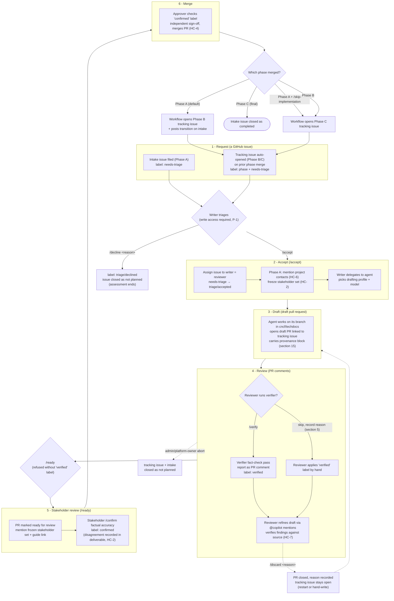

# Section 12: Lifecycle bindings — flow chart

This flow chart visualizes the per-assessment lifecycle described in Section 12,
"Lifecycle bindings," of the AI-assisted TechDocs Assessment spec. Each of the six
lifecycle steps binds to a native GitHub primitive (issues, PRs, labels) driven by
slash-command comments. The cycle repeats for each phase (A: assessment,
B: implementation plan, C: issue backlog).

## Legend

- **Solid arrows** — the normal forward path through the six lifecycle steps.
- **Dashed arrows** — failure and abort paths (`/discard`, administrator abort).
- **Slash commands** (`/accept`, `/decline`, `/verify`, `/ready`, `/confirm`,
  `/discard`, `/skip-implementation`) are human acts issued as ordinary comments,
  authorized against the role bindings.
- **Labels** (`needs-triage`, `triage/accepted`, `triage/declined`, `verified`,
  `confirmed`) record where each assessment stands; an issue search by phase label
  is the portfolio view.
- References such as **HC-x** and **P-x** point to the hard constraints and
  principles in Part I of the spec.
