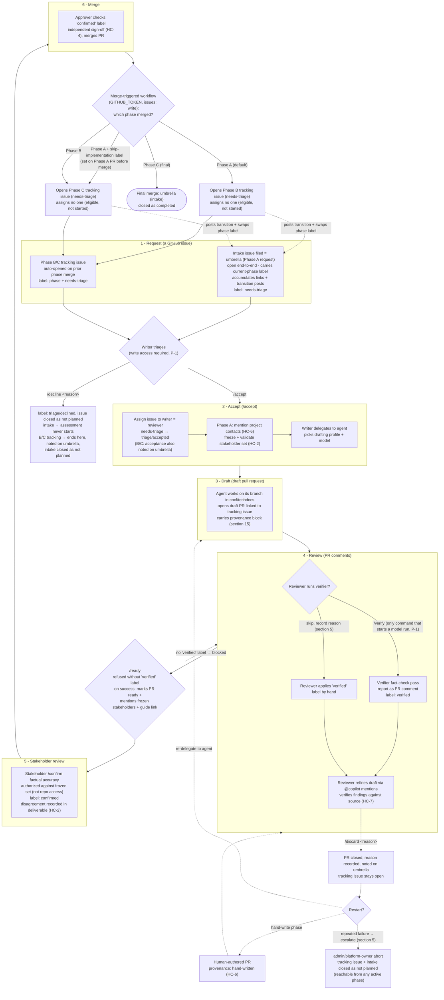

# Section 12: Lifecycle bindings — flow chart

This flow chart visualizes the per-assessment lifecycle described in Section 12,
"Lifecycle bindings," of the AI-assisted TechDocs Assessment spec. Each of the six
lifecycle steps binds to a native GitHub primitive (issues, PRs, labels) driven by
slash-command comments. The cycle repeats for each phase (A: assessment,
B: implementation plan, C: issue backlog).

## Legend

- **Solid arrows** — the normal forward path through the six lifecycle steps.
- **Dashed arrows** — the gate refusal, failure, restart, and abort paths
  (`/discard`, hand-write, administrator abort), plus the workflow's transition
  posts to the umbrella.
- **Umbrella (intake) issue** — the intake issue doubles as the assessment's
  umbrella. It stays open end to end, carries the current-phase label, and the
  merge-triggered workflow posts each transition to it and swaps its phase label.
- **Slash commands** (`/accept`, `/decline`, `/verify`, `/ready`, `/confirm`,
  `/discard`, `/skip-implementation`) are human acts issued as ordinary comments,
  authorized against the role bindings. Only `/verify` starts a model run (P-1).
- **Labels** (`needs-triage`, `triage/accepted`, `triage/declined`, `verified`,
  `confirmed`) record where each assessment stands; an issue search by phase label
  is the portfolio view.
- References such as **HC-x** and **P-x** point to the hard constraints and
  principles in Part I of the spec.

## Suggestions incorporated

This revision applied the following changes to tighten the chart's fidelity to
Section 12. They are recorded here so the rationale travels with the diagram.

1. **Modeled the intake as a persistent umbrella issue.** The spec stresses that
   the intake issue stays open end to end, accumulates cross-references, carries
   the current-phase label, and receives each transition post from the merge
   workflow. The chart now shows a standing umbrella node that the merge step
   posts transitions to and swaps the phase label on, instead of silently
   re-entering the tracking issue.
2. **Split the decline outcomes.** The single decline node now distinguishes the
   two spec cases: declining the intake means the assessment never starts,
   whereas declining a Phase B or C tracking issue ends the assessment there, is
   noted on the umbrella, and closes the intake as not planned.
3. **Showed both restart paths after `/discard`.** The tracking issue stays open
   for either a re-delegation to the agent or a hand-written phase. The chart now
   branches to both, with the hand-authored pull request re-entering review and
   carrying a hand-written provenance header (HC-6).
4. **Merged the duplicated `/ready` step.** `/ready` is now one node: it is
   refused without the `verified` label and, on success, marks the pull request
   ready and mentions the frozen stakeholder set with the participant-guide link.
5. **Reattached abort to the failure loop.** An administrator or platform-owner
   abort now follows repeated-failure escalation (section 5) and is annotated as
   reachable from any active phase, rather than hanging off the review step alone.
6. **Clarified `/skip-implementation` timing.** The skip label is set on the
   Phase A pull request before merge; the merge-triggered workflow then reads it
   to open Phase C instead of Phase B.

Minor annotations were also added: `/verify` is flagged as the only command that
starts a model run (P-1); the merge workflow notes that it assigns no one
(eligible, not started) and runs with `GITHUB_TOKEN` (`issues: write`); and
`/confirm` is noted as authorized against the frozen stakeholder set rather than
repository access.

